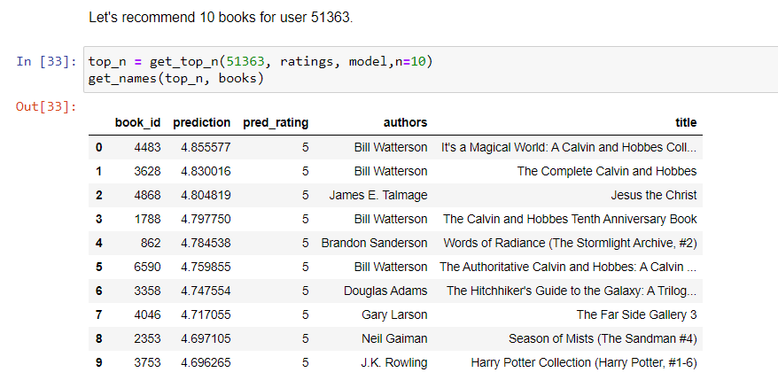

# Collaborative Filtering Books Recommender System

<p align="center">

*If you don’t like to read, you haven’t found the right book* - J.K. Rowling

</p>

---

## 📌 Description

The **Collaborative Filtering Books Recommender System** is a project aimed at building a recommendation engine that suggests books to users based on collaborative filtering techniques. The project explores various collaborative filtering approaches and compares their effectiveness in generating personalized book recommendations.

The system leverages user ratings data to provide book suggestions, utilizing methods like **KNN-based approaches** and **Singular Value Decomposition (SVD)**. The goal is to recommend books that align with users' interests based on their previous interactions and preferences.

---

## ⚙️ Demo

### 🔹 Book Recommendations  
Upload or input user data, and the system will predict personalized book recommendations.  

### 🔹 Visualizations  
Visualization of the recommendation results can be generated for analysis and insights.

---

## 💡 Features

- **Collaborative Filtering**: Utilizes user-item interactions to recommend books.
- **Multiple Models**: Includes several collaborative filtering models such as KNN, SVD, and more.
- **Evaluation Metrics**: RMSE (Root Mean Square Error) and MAE (Mean Absolute Error) are used to evaluate model performance.
- **Data Visualization**: Results are visualized for better insight into model performance.
- **Easy-to-Use**: Simple setup and easy-to-follow installation guide.

---

## ⚙️ Built With

- [Python](https://www.python.org/)
- [Surprise](http://surpriselib.com/) (for collaborative filtering)
- [Pandas](https://pandas.pydata.org/)
- [Matplotlib](https://matplotlib.org/)
- [NumPy](https://numpy.org/)
- [scikit-learn](https://scikit-learn.org/)

---

## 📂 Project Structure

Collaborative-Filtering-Books-Recommender/
- │
- ├── prediction.PNG            # Sample prediction image
- ├── Collaborative filtering methods.ipynb  # Jupyter Notebook with implementation details
- ├── README.md                 # Project documentation
- ├── eda.py                    # Exploratory Data Analysis script
- ├── grid_search.py            # Script for hyperparameter tuning using grid search
- ├── recommend.py              # Main recommendation engine
- ├── requirements.txt          # List of dependencies
- └── results_visualization.py  # Script for visualizing model performance


---

## 🚀 Getting Started

### 🔧 Prerequisites

- Python 3.8+
- pip (Python package installer)

### 📥 Installation

1. Clone the repo:
   ```bash
   git clone https://github.com/Maldev-2152/Collaborative-Filtering-Books-Recommender-System.git
   cd Collaborative-Filtering-Books-Recommender-System

2. Install dependencies:
   ```bash
   pip install -r requirements.txt

3. Run the script:
   ```bash
   python pdfminning.py


## Dataset

[Goodbooks-10k](https://github.com/zygmuntz/goodbooks-10k) - only books.csv and ratings.csv are used in this project.

## Results

The best [RMSE](https://en.wikipedia.org/wiki/Root-mean-square_deviation) and [MAE](https://en.wikipedia.org/wiki/Mean_absolute_error) were achieved by SVD - we want to minimalize these values. All models are better than random approach.

| Model | RMSE | MAE |
| --- | --- | --- |
| Random   |	1.321724 |	1.051821 |
| KNNBasic user_based	| 0.951170 |	0.760192 |
| KNNBaseline user_based |	0.853463 |	0.671673 |
|	KNNWithZScore user_based |	0.855638 |	0.665709 |
|	KNNWithMeans user_based |	0.857791 |	0.668161 |
|	KNNBasic item_based |	0.888497 |	0.696982 |
|	KNNBaseline item_based |	0.856132 |	0.668380 |
|	KNNWithZScore item_based |	0.866092 |	0.677739 |
|	KNNWithMeans item_based |	0.864491 |	0.676945 |
|	SVD |	0.845166 |	0.663349 |

## Example


